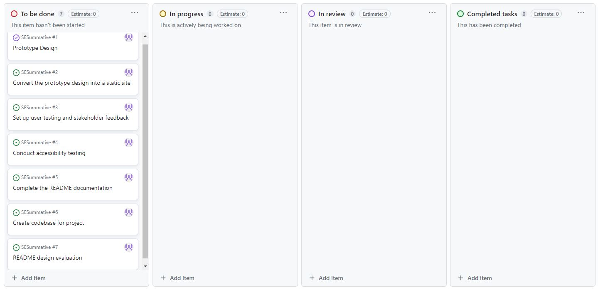
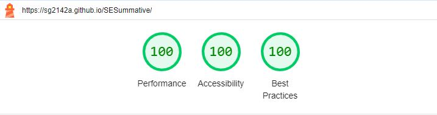

# Summative Assignment for the Software Engineering course

## Introduction to Assignment and Project
This assignment tasks us with the creation of a web app using the HTML, CSS and JavaScript stack. Importantly, the processes undertaken in creating such an app must be demonstrated and the use of project management tools and planning techniques discussed.

The project undertaken for this assignment was a simple currency converter, giving the user the opportunity to choose an amount, either in Great British Pounds or American Dollars, and allowing for swift conversion to the other. It should provide a quick and convenient option for currency conversion for a user.

## Tools used in project
The selected project management tool to host this project was Github. It is a free tool allowing users to manage code, using Git software, which itself provides version control, bug detection, continuous integration and task management amongst many other features.

For the purposes of prototyping the app, Figma was used, which is an application for interface design. One huge advantage of Figma is that it provides the option for a user to copy designs or parts of design as CSS code, reducing the coding burden and allowing users to be able to create their designs in front of them before transferring to code, rather than trial and error methods or similar.

The code stack of the web application will have three languages used, those being the aforementioned HTML, CSS and JavaScript. HTML (HyperText Markup Language) is the language that is the foundation of the app, providing the required structure to the content on a website. CSS (Cascading Style Sheets) takes the structure and layout of the site from HTML and styles it, and finally, JavaScript allows for the content to be made interactive. In this scenario, the HTML will define the site's structure, the CSS things such as colour and font, and the JS is what allows for the conversions to be made.

## Using Agile methodology to manage the project
Agile methodology will be used to manage this project. It is a project management method that focuses upon continuous development and improvement. The project is completed incrementally, allowing for the customer to constantly know the status of the project and to be able to give feedback so improvments can be made. Unlike a linear method such as waterfall, which has a set of requirements that are difficult to change, and means that the client receives little opportunity to be involved in the process, Agile works in short cycles known as "sprints", and has outputs available that allow for collaboration.

In a below section, it will be discussed how tasks within the project are divided into issues that can be submitted through the project management tool being used (GitHub Projects). Typically, Agile methods have a number of developers working on it, so being able to organise tasks in a method such as a kanban board (discussed below) is extremely useful, because it allows all members of the team to understand where each element of the project is, and allows for greater ease in dividing workload. As, in this case, it is just me developing the solution, this is not as important, but having good documentation will make things easier as I can track my own progress and easily demonstrate to stakeholders where I am at as well.

## Initial Kanban board to represent project tasks
One Agile method that I used to manage this project was a kanban board. This is a tool that presents each task to be completed as a card, that can be placed into one of multiple columns depending on how far through the process it is. In this case, my initial kanban board can be seen below, with four phases- to be done, in progress, in review and completed. Throughout the course of the project, this tool can be used to help me keep tabs on exactly what is going on with my project, allowing me to understand exactly where I am and what I need to complete.

## Prototype Design
As discussed above, the Figma tool was used to design the prototype of the app, which can be seen below. At this stage, this was for the purposes of understanding what the application could look like rather than than being a strict design to be followed. This allows room for creativity where needed and as the solution develops, requirements and/or concepts may change, and the design can do the same with it.

## Stakeholder Feedback
At this stage, having been using the Agile methodology, I took the opportunity to source feedback from stakeholders on the design of the product. I used a [Google form](https://forms.gle/okG33S6KpxcWyrvK7) to do this, asking stakeholders whether they thought this was a good design and providing the opportunity for any comments they may have wanted to make.

## Kanban board update

## Codebase - CSS
The first stage of the coding completed was taking the Figma design and transforming it into a viable product. As mentioned above, Figma provides the option to copy sections of your design as CSS, which can be dropped straight into your coding software- I was using Visual Studio Code. An example of the code is provided below, which is setting the background colour of the site and introducing the classes, such as the boxes that will be placed on the site. Positioning, sizing, colouring and round-edge borders are amongst the factors being altered in this example.

Another place where CSS was used in this project was to format the fields created in the HTML forms. When they were initially created, the input box, button to convert and outputs were all in the top left of the site. When they were then added to the same container as the box, they were in the top left of their respective boxes. As a result, I then used CSS formatting to move the boxes and change their size and formatting to make a more appealing output. The code can be seen below.

## Codebase - HTML
To begin with the HTML element of the code, I used a boilerplate through the Emmet extension, which set up my basic structure, in terms of head and body tags and character sets, amongst other things. This meant that when I wanted to start coding, everything was ready to go and just needed to go within the body tags. Within the divider for each box (both of the two converters were set up within their own box), I placed the input field, convert button and output field within their own divider, and used the padding-top variable to place them in a more central location. An example of the divider for one of the boxes can be seen below.

## Codebase - JavaScript
The final element towards creating full functionality of my site was the JavaScript. The HTML and CSS code alone creates a site but with no interactive functionality. JavaScript code is how the site will gain its functionality, in being able to convert currencies. To begin, I created variables for the input and output fields, allowing me to retrieve whatever is entered by the user on the site and use it in JavaScript. This was done by using the document.getElementById method. These methods can be seen below.

With this done, and the link created between the JavaScript and CSS/HTML, I added events to my buttons to tell my site what to do when a user requested a conversion. This was done through the addEventListener method, and created instructions for the submit event, which in this case, was the user pressing the "convert" button. I did two things in these instructions- the first was the conversion, using the .toFixed method to ensure that all results were rounded to two decimal places in order to maintain consistency as a currency converter. The second was an if statement. The reason for this was discovered through the test-driven development, when I realised that my initial methods meant that negative values were accepted and converted, which obviously was not realistic or correct. Using my if statement, I added that if the input was greater than or equal to zero, then the conversions should be displayed as normal through the innerHTML methods, however, outside of that (using else, inferring any scenario where a negative number is inputted", an error message would be displayed requesting a postiive number. This code can be seen below.

## Deployed web app and user testing
With the coding completed, I then used the GitHub Pages option to deploy this site at the following link: https://sg2142a.github.io/SESummative/

An example of the deployed site can be seen below. In the first box ($ to £), the normal functionality of the converter is demonstrated. In the second (£ to $), the JavaScript code to prevent negative inputs from being submitted. This was a basic user test completed in order to validate that the functionalities of the site were working as expected.

## Kanban board update

## Accessibility testing of the deployed site
Another crucial element of building any website or app is accessibility. Testing of accessibility ensures site usability for all potential users and covers a range of disabilities that users may have, such as visual disabilities (eg. colour blindness), physical disabilities and learning difficulties amongst many others. Research has suggested that 15% of the world's population have a disability of some form, meaning that accessibility testing is a vital part of the creation of any website.

For this site, I used the Google Lighthouse tool to test my site. This tests on three factors- performance, accessibility and best practices, and marks each with a score out of 100. As can be seen below, my site scored perfectly on all three metrics, suggesting that I have created a highly accessible site.

## Kanban board update

## Project Evaluation
Overall, I am very happy with how this project went. HTML, CSS and JavaScript were all completely new to me, as was hosting through a repository on GitHub. Despite this, I believe I was able not just to create a working solution, but also one that could handle poor inputs. This means that the converter can only be used for positive integers, so inputs cannot be negative or anything other than a number to be converted.

Upon reflection, there are definitely areas that I would like to improve upon in future. One of those is the addition of unit testing. I set up the methods on Visual Studio Code through Jest and was able to run a smoke test, but couldn't get further than that. I think that one potential reason for this was because the conversions were nested within the eventListener. If they were created as separate functions that could then be called when required, this may have been more effective. However, I was still able to run three types of testing, in the forms of stakeholder feedback, user testing and accessibility testing, so this still covers a broad range.

Within the Google Lighthouse testing, there were a few small suggestions made within the performance section in order to improve this further. These are minifying the JavaScript (making the file smaller and therefore easier to parse by removing unnecessary characters) and serving static assets with an efficient cache policy (helps to improve the time it takes for the page to load by using the user's web browser to store files that are present within the site. These are considerations I could make next time.

As this project was just me, a lot of the Agile methodology was not really able to be applied in this case. Although I have definitely learnt a lot from using these methods (benefits of incremental work, receiving feedback, using a kanban board), it would be great to apply this even more by running a group Agile project to truly gain an understanding of how effective these methods can be.
